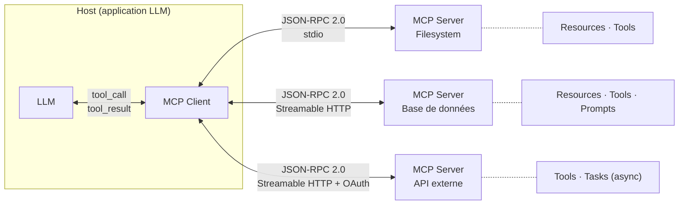

## Le standard MCP : connecter les agents aux outils sans code custom

Avant MCP, connecter un agent à un outil, c'était écrire un wrapper. Puis un autre pour l'outil suivant. Puis un autre. Chaque intégration avait son format, ses conventions, ses quirks. Un agent qui avait besoin de cinq outils avait cinq wrappers différents à maintenir.

**Model Context Protocol (MCP)** règle ce problème. C'est un protocole ouvert — publié par Anthropic en novembre 2024 et gouverné sous licence Apache 2.0 — qui standardise comment un agent se connecte à un outil, quelle que soit la stack de l'un ou de l'autre.

### L'architecture : host, client, server

MCP introduit trois rôles distincts.

- **Le host** : l'application qui embarque le LLM (Claude Desktop, Cursor, un agent custom…). C'est lui qui orchestre les connexions.
- **Le client MCP** : le composant côté host qui parle au serveur. Un client = une connexion à un serveur.
- **Le server MCP** : le processus qui expose les capacités d'un outil (une base de données, un filesystem, une API externe…).

La communication entre client et serveur passe par **JSON-RPC 2.0** — un format de messages léger, synchrone ou asynchrone. Le transport peut être :
- **stdio** : JSON-RPC sur stdin/stdout, pour les outils locaux (haute performance, zéro réseau).
- **Streamable HTTP** : transport distant recommandé depuis mars 2025, qui supporte l'authentification (Bearer token, API key, OAuth 2.0) et le streaming.

### Les primitives : trois types de capacités

Un serveur MCP expose trois types de primitives.

**Resources** : données en lecture seule — fichiers, résultats de requête, contenu d'une page. L'agent peut lire, pas modifier. C'est la surface d'exposition la moins risquée.

**Tools** : actions exécutables. C'est ici que tout se joue en production. Un tool MCP a un nom, un schéma JSON d'entrée, et retourne un résultat. L'agent invoque le tool via le client ; le serveur l'exécute.

**Prompts** : templates réutilisables paramétrables. Un serveur peut exposer des prompts préconstruits que l'agent instancie. Pratique pour standardiser des workflows complexes.

La spec 2025-11-25 a ajouté une quatrième primitive expérimentale : **Tasks** — qui permet à une requête de devenir asynchrone ("appelle maintenant, récupère plus tard"). C'est la réponse aux outils qui prennent du temps.



### Le lien avec la sécurité des outils (7.3)

MCP standardise l'interface, pas la sécurité. C'est au host et au client de l'implémenter.

```python
# ❌ Approche naïve : exposer tous les tools au modèle sans filtre
mcp_client.list_tools()  # retourne les 40 tools du serveur
# L'agent peut appeler n'importe lequel — y compris delete_database()

# ✅ Approche correcte : filtrer par rôle avant d'injecter dans le contexte
allowed = [t for t in mcp_client.list_tools()
           if t.name in current_actor.allowed_tools]
# Seuls les tools autorisés sont visibles du modèle
```

Le **moindre privilège** de 7.3 s'applique ici : ne jamais exposer tous les tools du serveur au modèle. Filtrer selon le rôle de l'acteur (lien 7.2 et 9.4).

Le risque de **tool poisoning** (7.3) est réel avec MCP : si un serveur tiers est compromis, ses descriptions de tools peuvent contenir des instructions malveillantes dans le schéma. La règle : traiter les descriptions de tools comme du contenu non fiable, exactement comme n'importe quelle donnée externe.

La spec recommande explicitement que les hosts construisent des **flux de consentement robustes** : l'utilisateur doit savoir quels tools sont accessibles et approuver les connexions. En pratique, ça ressemble à OAuth — sauf que c'est pour des outils, pas pour des données.

### Ce que MCP ne résout pas

MCP standardise le canal. Pas le contenu. Un serveur MCP peut exposer un tool qui fait n'importe quoi — déclencher un paiement, supprimer des fichiers, envoyer un email.

La sécurité reste la responsabilité de qui déploie le serveur :
- **Authentification du client** : qui a le droit de se connecter au serveur ?
- **Autorisation par action** : qui a le droit d'appeler quel tool ?
- **Audit** : chaque appel de tool est-il loggé ? (lien 6.3, DecisionLog)

MCP résout le problème d'intégration. Pour le reste — trust, isolation, audit — c'est la Partie 7 et la Partie 9.

**Exemple concret :**
Un agent de support documentaire connecté à un serveur MCP exposant lecture de fichiers, recherche full-text et envoi d'email. Sans filtrage, l'agent peut envoyer un email à n'importe qui si sa boucle réagit à un contenu malveillant dans un document. Avec filtrage par rôle — l'outil email inaccessible au sous-agent lecture — l'injection indirecte (7.2) ne peut pas déclencher d'exfiltration. La surface d'attaque est réduite à la liste des tools réellement nécessaires.

### L'écosystème en 2025–2026

L'avantage pratique de MCP : il existe aujourd'hui des **serveurs MCP publics** pour les outils courants — GitHub, Slack, Google Drive, PostgreSQL, Brave Search. Connecter un agent à ces outils ne demande plus de code d'intégration : juste une déclaration de connexion dans le host.

```json
// Configuration MCP dans un host (exemple simplifié)
{
  "mcpServers": {
    "github": {
      "command": "npx",
      "args": ["-y", "@modelcontextprotocol/server-github"],
      "env": { "GITHUB_TOKEN": "${GITHUB_TOKEN}" }
    }
  }
}
```

C'est la même logique que npm pour les packages : un registre de serveurs, un protocole commun, et chaque outil n'a besoin d'être écrit qu'une fois.

La Partie 11 montrera comment ce modèle a été utilisé en pratique. Mais d'abord, le problème suivant : quand l'outil est un autre agent.
