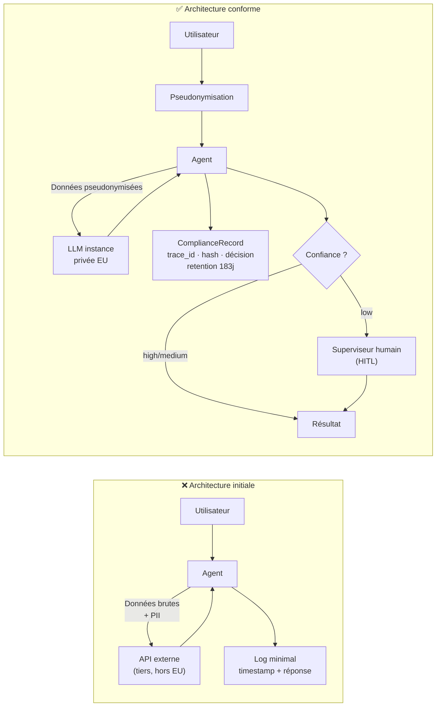

> *Cas réel anonymisé — détails modifiés pour confidentialité.*

## Architecture avant modèle : leçon d'un contexte sensible

La première chose qu'on m'a demandée, c'est quel modèle on allait utiliser.

Ma première réaction aurait dû être un signal d'alarme. Quand la première question est le modèle, c'est souvent qu'on n'a pas encore pensé à l'architecture. Dans un contexte ordinaire, c'est un raccourci acceptable — on ajustera en cours de route. Dans ce contexte, ça n'était pas acceptable du tout.

### Le contexte

Un organisme public — je n'en dis pas plus sur le secteur ou la taille pour des raisons de confidentialité — avait besoin d'un système capable de synthétiser et d'orienter des demandes internes : documents administratifs, requêtes de traitement, escalades vers les bons services. Rien de révolutionnaire. Le volume était gérable (~estimation : plusieurs centaines de requêtes par jour). L'équipe technique était compétente. Le budget était là.

Mais le contexte portait deux contraintes que personne n'avait mis sur la table au moment de parler du modèle.

**Contrainte 1 : les données étaient potentiellement sensibles.** Pas des données médicales ou financières au sens strict, mais des informations nominatives sur des agents publics et des usagers. La question "est-ce qu'on peut envoyer ces données à une API externe ?" n'avait pas de réponse simple. Elle nécessitait un avis juridique, un DPA (Data Processing Agreement) avec le fournisseur de modèle, et probablement une validation de la DSI.

**Contrainte 2 : l'EU AI Act classait ce système.** Le système prenait des décisions d'orientation qui affectaient des personnes. Pas des décisions lourdes au sens de l'Annexe III, mais assez pour qu'une analyse de conformité soit requise — obligations de traçabilité, de supervision humaine, de conservation des logs (Art. 26 : au minimum 6 mois).

Ces deux contraintes auraient dû être les premières questions. Elles n'ont été posées qu'après que j'avais déjà vu des maquettes de l'interface.

### L'architecture initiale et ses problèmes

La première version du système envoyait les requêtes directement à une API LLM externe, sans transformation ni anonymisation. Les logs étaient basiques — timestamp, user_id, réponse. Pas de trace de ce que le modèle avait reçu en input, pas de version du modèle enregistrée, pas de mécanisme de rétention.

```python
# ❌ Première version — log minimal, données brutes vers API externe
def process_request(user_id: str, content: str) -> str:
    response = openai_client.chat.completions.create(
        model="gpt-4o",
        messages=[{"role": "user", "content": content}]
    )
    log(user_id, response.choices[0].message.content)  # log basique
    return response.choices[0].message.content
```

Trois problèmes concrets :

**1. Données nominatives vers une API externe sans DPA établi.** Le prestataire avait un DPA générique, mais personne n'avait vérifié qu'il couvrait ce cas d'usage spécifique, ni que les données ne servaient pas à l'entraînement. C'est le problème LLM02 de l'OWASP (7.4) : exfiltration non intentionnelle de données sensibles vers un tiers.

**2. Logs insuffisants pour la conformité.** Art. 26 de l'EU AI Act : le déployeur doit conserver les logs permettant de reconstituer la décision. "Timestamp + user_id + réponse" ne suffit pas. Il faut l'input (ou un hash), la version du modèle, la décision prise, et l'identité de l'agent humain qui a validé (si applicable).

**3. Absence de supervision humaine.** Pour une architecture assistée, c'est acceptable si le système ne prend pas de décision autonome. Mais le système orientait automatiquement vers des services — c'était déjà une forme de décision à valider.

### La correction

On a revu l'architecture dans l'ordre inverse : conformité → sécurité → modèle.

**Étape 1 : cartographier le flux de données.** Quelles données entrent ? Où vont-elles ? Qui y a accès ? Cette cartographie a pris deux jours et révélé que 30 % des requêtes contenaient des noms et numéros d'identification. Ces champs ont été pseudonymisés avant l'appel LLM.

**Étape 2 : choisir le modèle en fonction des contraintes.** La contrainte de souveraineté des données a éliminé les APIs externes sans hébergement EU certifié. Ça a réduit les options à des modèles déployés en instance privée (cloud EU avec garantie d'isolation) ou à un modèle auto-hébergé. On a choisi la première option — plus opérable pour l'équipe existante.

**Étape 3 : implémenter le `ComplianceRecord` (8.4) sur chaque décision.**

```python
# ✅ Enregistrement conforme de chaque décision
@dataclass(frozen=True)
class ComplianceRecord:
    decision_id: str
    timestamp: float
    model_version: str
    input_hash: str           # hash SHA-256 de l'input pseudonymisé
    decision: str             # orientation prise par le système
    confidence: str           # "high" / "medium" / "low"
    human_override: str | None  # ID de l'agent si supervision active
    retention_until: float    # timestamp J+183 (6 mois + marge)

def process_request(actor_id: str, raw_content: str) -> ProcessingResult:
    pseudonymized = pseudonymize(raw_content)
    input_hash = sha256(pseudonymized.encode()).hexdigest()

    response = llm_client.complete(pseudonymized)
    decision = parse_orientation(response)

    record = ComplianceRecord(
        decision_id=generate_uuid(),
        timestamp=time.time(),
        model_version=llm_client.model_version,
        input_hash=input_hash,
        decision=decision.label,
        confidence=decision.confidence,
        human_override=None,      # sera rempli si l'agent modifie
        retention_until=time.time() + 183 * 86400
    )
    compliance_store.save(record)
    return ProcessingResult(decision=decision, record_id=record.decision_id)
```

**Étape 4 : supervision humaine sur les cas de faible confiance.** Quand `decision.confidence == "low"`, le système soumet à un agent humain avant d'agir. C'est le pattern HITL (2.3) appliqué à la conformité : pas de décision autonome quand l'incertitude dépasse un seuil.



### Ce qui a changé

Le modèle final était moins performant que GPT-4o sur les benchmarks généraux. Il était adapté aux contraintes du contexte. C'est la bonne métrique.

La latence a augmenté légèrement (pseudonymisation + compliance logging + supervision conditionnelle). C'était acceptable — et prévisible, parce qu'on l'avait anticipé dans les SLOs plutôt que de le découvrir en production.

Les logs permettent maintenant de répondre à n'importe quelle question d'audit : "quelle décision a été prise pour cette requête, avec quel modèle, validée par qui, à quelle heure ?"

### La leçon

**Dans un contexte réglementé, le choix du modèle est une décision tardive.**

L'ordre correct est :
1. Cartographier les données et leurs contraintes (RGPD, secteur, sensibilité).
2. Identifier le niveau de risque EU AI Act (Annexe III ou non).
3. Définir les obligations de logging, supervision, rétention.
4. Concevoir l'architecture qui respecte ces contraintes.
5. Choisir le meilleur modèle parmi ceux qui satisfont les contraintes architecturales.

Commencer par le modèle, c'est construire la maison avant de connaître le terrain. On finit toujours par devoir refaire les fondations.

Ce n'est pas une spécificité du public. J'ai vu le même pattern dans des contextes privés sensibles (santé, finance, RH). Dès qu'il y a des données personnelles ou des décisions qui affectent des personnes, la conformité est une contrainte architecturale — pas un ajout de fin de projet.

**Signal d'alarme universel :** si la première réunion projet tourne autour du choix du modèle sans avoir établi où les données vont, c'est le moment d'arrêter et de poser les bonnes questions.
