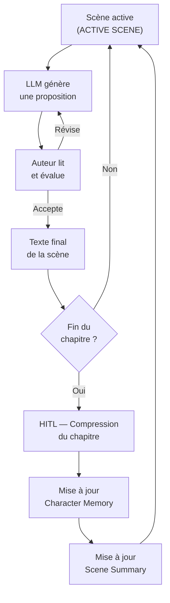

## revise.studio : context engineering pour la fiction longue

revise.studio est une plateforme qu'on a co-fondée pour aider les auteurs à écrire de la fiction longue avec l'assistance d'un LLM. Pas un chatbot de créativité. Un outil d'aide à l'écriture structurée — continuité narrative, cohérence des personnages, préservation de la voix de l'auteur sur des projets de 50 000 à 120 000 mots.

Le problème central : à 200 000 tokens de contexte disponibles, on peut techniquement faire tenir un roman de taille moyenne. En pratique, la qualité de l'assistance s'effondre bien avant d'atteindre la limite.

Trouver *pourquoi* a pris du temps. Comprendre *comment* y remédier a pris encore plus de temps.

### Le problème de la fenêtre longue

La première version du système suivait une logique simple : on garde tout le roman dans le contexte, et le modèle a accès à tout. Pour un premier chapitre ou une nouvelle courte, ça marche bien. Pour un roman, trois problèmes émergent progressivement.

**Problème 1 : attention diffuse.** Les modèles actuels (comme tous les Transformers) ont une attention qui se dilue sur les contenus lointains dans la fenêtre. Concrètement : le modèle "oublie" les détails des chapitres 1–5 quand il génère le chapitre 18, même si ces chapitres sont techniquement dans la fenêtre. Ce n'est pas un bug — c'est le comportement attendu de l'architecture.

**Problème 2 : drift de voix.** La voix d'un auteur est faite de micro-patterns : longueur de phrases, tournures favorites, ponctuation, rythme. Sur 80 000 mots générés ou co-écrits au fil du temps, ces patterns dérivent imperceptiblement à chaque session. À la 20ème session, le chapitre 20 a un ton légèrement différent du chapitre 1 — assez pour qu'un lecteur attentif le sente.

**Problème 3 : timeline et continuité.** Des faits établis (le personnage boite de la jambe gauche depuis le chapitre 3) disparaissent des générations du chapitre 15, non parce que le modèle les "oublie" au sens humain du terme, mais parce qu'ils sont noyés dans 70 000 tokens d'autres détails avec une densité d'attention insuffisante.

### L'architecture naïve et ses limites

```python
# ❌ Première architecture — full context, session après session
async def assist_writing(novel_so_far: str, current_chapter_draft: str) -> str:
    # novel_so_far peut faire 200k tokens — fenêtre complète
    response = await llm.complete(
        system="Tu es l'assistant d'écriture de l'auteur.",
        context=novel_so_far,          # ❌ tout dans la fenêtre
        user=f"Continue ce chapitre :\n{current_chapter_draft}"
    )
    return response
```

Cette architecture fonctionne jusqu'à ~20 000 mots. Elle commence à dériver à ~40 000. Elle est inutilisable de façon fiable au-delà de ~70 000.

Les premiers retours d'auteurs étaient révélateurs : *"Le modèle m'a fait écrire un personnage secondaire dans une scène alors qu'il est mort deux chapitres avant."* Pas d'erreur technique dans le système — le modèle avait simplement accordé moins d'attention à ce détail précis dans la masse du contexte.

### Le context engineering structuré

La solution n'est pas "plus de contexte". C'est de l'architecture de contexte : décider *ce qui entre* dans la fenêtre active, *ce qui est compressé*, et *ce qui reste externalisé*.

On a découpé l'état du roman en quatre couches :

```
[STRUCTURE DU CONTEXTE ACTIF]

┌─────────────────────────────────────────────────────┐
│ 1. STYLE REFERENCE (~2 000 tokens)                  │
│    Extraits verbatim de l'auteur : 10-15 phrases     │
│    caractéristiques, jamais modifiées, toujours      │
│    présentes en haut du contexte.                    │
├─────────────────────────────────────────────────────┤
│ 2. CHARACTER MEMORY (~3 000 tokens)                  │
│    Fiche compressée par personnage : traits, arc,    │
│    faits établis (jambe gauche, mort chap. 3...).    │
│    Mise à jour par l'humain à chaque chapitre.       │
├─────────────────────────────────────────────────────┤
│ 3. SCENE SUMMARY (~4 000 tokens)                     │
│    Résumé roulant des N derniers chapitres.          │
│    Compressé au franchissement de chaque frontière   │
│    de chapitre (compression humaine ou LLM validée). │
├─────────────────────────────────────────────────────┤
│ 4. ACTIVE SCENE (variable, ~10 000 tokens max)       │
│    Texte complet de la scène en cours.               │
└─────────────────────────────────────────────────────┘
```

Ce que le modèle ne reçoit jamais dans la fenêtre active : les chapitres 1 à N-4. Ils sont dans la base vectorielle, requêtable si un détail spécifique est nécessaire, mais ils ne prennent pas de place dans la fenêtre active.

```python
# ✅ Architecture structurée — contexte architectural
async def build_active_context(novel_state: NovelState) -> ActiveContext:
    return ActiveContext(
        style_reference=novel_state.author_style_samples,   # verbatim, immutable
        character_memory=novel_state.character_sheets,       # compressé, structuré
        scene_summary=novel_state.rolling_summary,           # N derniers chapitres
        active_scene=novel_state.current_scene_draft         # texte en cours
    )

async def assist_with_scene(novel_state: NovelState, user_intent: str) -> str:
    context = await build_active_context(novel_state)
    
    # Retrieval ciblé si un fait spécifique de l'histoire lointaine est nécessaire
    if needs_historical_fact(user_intent):
        retrieved = await novel_retriever.search(
            query=user_intent,
            top_k=3,
            filter={"chapter_range": [1, novel_state.current_chapter - 4]}
        )
        context.historical_facts = retrieved

    response = await llm.complete(
        system=WRITING_ASSISTANT_SYSTEM,
        context=context.to_prompt(),
        user=user_intent
    )
    return response
```

### Le HITL comme gardien de la continuité

La compression des scènes summary et des fiches personnages est le point de fragilité du système. Si le résumé d'un chapitre omet un fait clé, ce fait disparaît du contexte actif — et de toutes les générations futures.

C'est pourquoi la compression est un moment HITL. À la fin de chaque chapitre :

1. Le système génère un résumé candidat du chapitre.
2. L'auteur valide et corrige (typiquement 5–10 minutes).
3. Les fiches personnages sont mises à jour manuellement ou validées si le LLM en propose une mise à jour.

Ça peut sembler lourd. En pratique, les auteurs apprécient ce moment — c'est une pause de relecture qui aide à maintenir une vision globale de leur histoire. Le HITL n'est pas un fardeau : c'est le moment où l'auteur reste aux commandes de sa narration.



### La voix préservée

La `STYLE REFERENCE` mérite une attention particulière. C'est la couche qui empêche le drift de voix.

Elle contient des extraits verbatim de l'auteur — pas résumés, pas paraphrasés. Des vraies phrases, avec leurs tournures, leur rythme, leur ponctuation spécifique. Le modèle les lit en début de contexte et elles "calibrent" le registre de sortie.

On a testé sans cette couche et avec. La différence est perceptible dès le troisième chapitre : sans style reference, le modèle converge progressivement vers un style neutre et "propre" — plus correct, moins distinctif. Avec style reference, la voix reste reconnaissable.

Ce n'est pas de la magie. C'est de la mise en contexte : le modèle imite ce qu'il voit. Si on lui montre le style de l'auteur, il l'imite. Si on ne lui montre rien, il choisit par défaut.

### La leçon

**Pour un projet de fiction longue, le contexte n'est pas une ressource à maximiser — c'est une ressource à gérer.**

Les quatre couches (style, personnages, résumé roulant, scène active) ne sont pas une architecture complexe. C'est le minimum viable pour écrire 80 000 mots avec cohérence.

Ce que ça illustre pour n'importe quel domaine à long horizon :

1. **Le contexte actif doit être architectural.** Décider ce qui entre dans la fenêtre est un choix de design, pas un détail d'implémentation.
2. **La compression est un risque.** Tout résumé perd de l'information. Le HITL sur la compression protège les faits qui ne doivent pas être perdus.
3. **La voix (ou l'invariant métier) se préserve par exposition répétée, pas par instruction générale.** "Conserve le style de l'auteur" dans le system prompt ne suffit pas. Des exemples verbatim en contexte, si.

Ce problème — maintenir la cohérence sur un horizon long — existe dans tous les domaines. Un agent de support qui doit maintenir la cohérence de ses réponses sur 6 mois de tickets. Un agent de rédaction juridique qui doit respecter les formulations exactes d'un contrat-cadre. La solution architecturale est la même : couches de contexte, compression supervisée, invariants préservés verbatim.
