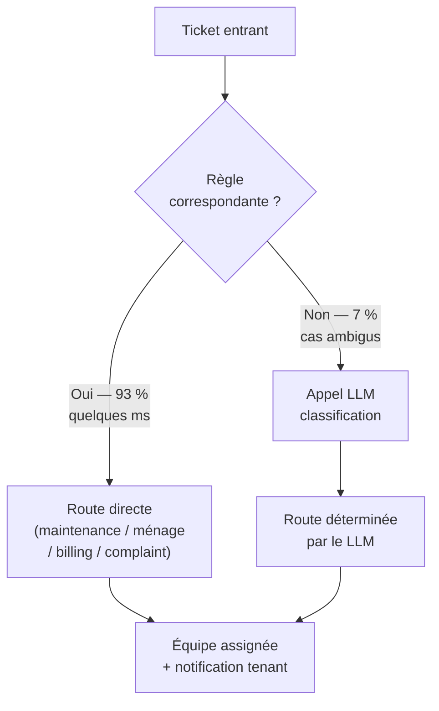

## Hotelix : le workflow déterministe qu'on a failli appeler agent

Hotelix est un logiciel de gestion hôtelière — planification des chambres, suivi des équipes, traitement des tickets opérationnels (maintenance, ménage, réclamations clients, facturation). Le projet : automatiser le traitement initial des tickets entrants pour réduire la charge manuelle du personnel de réception.

Le problème semblait parfait pour un système multi-agent : des tickets de types variés, des équipes spécialisées selon le type, des règles de priorité, des cas ambigus. On a failli construire quelque chose de très compliqué pour un problème qui ne le méritait pas.

### L'architecture qu'on a envisagée

L'idée initiale : un système de trois agents.

**Agent 1 — Triage.** Lit le ticket, détermine le type (maintenance / ménage / réclamation / facturation) et la priorité (urgence / normal / différable).

**Agent 2 — Spécialisé.** Selon le type détecté par l'agent 1, un agent spécialisé prend le relai. Chacun connaît les règles et workflows de son domaine.

**Agent 3 — Response.** Formule la réponse au client ou la notification à l'équipe concernée, avec le ton approprié.

C'est une architecture qui se défend. Elle semble modulaire, extensible, claire. Le problème : on a conçu pour la complexité *avant* d'analyser la distribution réelle des tickets.

```python
# Ce qu'on voulait construire
pipeline = MultiAgentPipeline([
    TriageAgent(tools=[classify_ticket, assess_priority]),
    SpecialistRouter(agents={
        "maintenance": MaintenanceAgent(...),
        "housekeeping": HousekeepingAgent(...),
        "billing": BillingAgent(...),
        "complaint": ComplaintAgent(...)
    }),
    ResponseAgent(tools=[format_response, notify_team])
])
# Résultat : 2–3 appels LLM par ticket, ~8–12 secondes de latence
```

### L'analyse de la distribution réelle

Avant d'implémenter, j'ai demandé à voir des tickets réels — un échantillon de 200 tickets issus de plusieurs hôtels. L'objectif : comprendre à quoi ressemble vraiment le problème.

Résultat de l'analyse :

| Catégorie | Proportion |
|-----------|-----------|
| Maintenance standard (fenêtre, ampoule, plomberie) | ~45 % |
| Ménage (chambre à refaire, linge) | ~28 % |
| Réclamation simple (bruit, température) | ~12 % |
| Facturation (erreur de montant) | ~8 % |
| Cas ambigus ou multi-catégorie | ~7 % |

90 % des tickets entraient dans une catégorie claire avec des mots-clés prévisibles. "Lampe cassée chambre 214" → maintenance. "Serviettes manquantes chambre 108" → ménage. Il n'y avait rien d'ambigu — les règles de routing étaient simples et stables.

Seulement 7 % des tickets nécessitaient un raisonnement. C'est là que le LLM avait une valeur ajoutée réelle.

Construire trois agents LLM pour servir 93 % de cas déterministes : c'est la définition de l'over-engineering.

### L'architecture finale : workflow + LLM ciblé

```python
# ✅ Architecture finale — workflow déterministe + LLM uniquement sur les cas ambigus

ROUTING_RULES = [
    (r"(lampe|ampoule|fenêtre|plomberie|chauffage|climatisation)", "maintenance"),
    (r"(serviette|linge|ménage|nettoyer|chambre propre)", "housekeeping"),
    (r"(facture|montant|erreur de prix|remboursement)", "billing"),
    (r"(bruit|température|voisin|odeur)", "complaint"),
]

async def route_ticket(ticket: Ticket) -> RoutingResult:
    text = ticket.content.lower()

    # Étape 1 : routing déterministe (règles)
    for pattern, category in ROUTING_RULES:
        if re.search(pattern, text):
            return RoutingResult(
                category=category,
                confidence="high",
                method="rules"
            )

    # Étape 2 : LLM uniquement si aucune règle ne matche
    result = await llm.classify(
        system=TICKET_CLASSIFIER_SYSTEM,
        content=ticket.content,
        options=list(CATEGORY_DEFINITIONS.keys())
    )
    return RoutingResult(
        category=result.category,
        confidence=result.confidence,
        method="llm"
    )
```

Le résultat : une seule invocation LLM pour ~7 % des tickets. Les 93 % restants sont traités par le workflow en quelques millisecondes. La latence globale est divisée par ~10. Le coût token est divisé d'autant.



### Le problème d'isolation multi-tenant

L'architecture multi-agent qu'on avait envisagée créait un problème d'isolation plus subtil.

Hotelix est un logiciel SaaS multi-tenant : plusieurs hôtels, chacun avec ses règles, ses équipes, ses priorités. Dans le modèle multi-agent, chaque agent avait accès à un contexte partagé — une session LLM qui s'étendait sur plusieurs appels. Le risque : des informations d'un hôtel "contaminent" le contexte d'un autre.

Exemple concret : l'agent de triage avait vu dans sa session le contexte de l'hôtel A (priorités de maintenance spécifiques). Le ticket suivant vient de l'hôtel B. L'agent raisonne encore avec le contexte de A.

Avec le workflow déterministe, ce problème disparaît : chaque requête est stateless. Le `tenant_id` est un paramètre de requête, pas une variable de session LLM. L'isolation est triviale.

```python
# ✅ Isolation multi-tenant garantie par design stateless
async def process_ticket(ticket: Ticket, tenant_id: str) -> ProcessingResult:
    tenant_config = tenant_store.get(tenant_id)  # config isolée par tenant
    routing = await route_ticket(ticket)           # stateless

    team = tenant_config.get_team_for_category(routing.category)
    response = await format_response(
        ticket=ticket,
        routing=routing,
        tenant_style=tenant_config.response_style  # chaque tenant a son style
    )

    log_ticket_processing(
        tenant_id=tenant_id,
        ticket_id=ticket.id,
        routing=routing,
        idempotency_key=ticket.idempotency_key     # idempotence (9.2)
    )
    return ProcessingResult(team_notified=team, response_sent=response)
```

L'idempotency key sur chaque ticket (9.2) garantit qu'un ticket traité deux fois (retry réseau, double-submit) ne génère pas deux notifications à l'équipe. Dans le modèle multi-agent, cette garantie était plus complexe à implémenter — chaque agent aurait dû propager et vérifier la clé. Dans le workflow, c'est un check à un seul endroit.

### Ce qu'on a gardé du LLM

Le LLM n'a pas disparu. Il fait deux choses dans l'architecture finale :

1. **Classification des tickets ambigus** (7 % des cas) — sa vraie valeur ajoutée.
2. **Rédaction des réponses client** pour les catégories "réclamation" — là où le ton et l'empathie comptent et où le déterminisme ne suffit pas.

Pour ces deux usages, le LLM est excellent. C'est *là* que la complexité de décision justifie le coût de l'agent.

### La leçon

**La première question à se poser n'est pas "comment architecturer le multi-agent". C'est "quelle est la distribution réelle des cas ?"**

Si 90 % des cas sont déterministes, vous n'avez pas un problème d'agent. Vous avez un problème de workflow avec un cas d'agent à l'intérieur.

Trois apprentissages concrets :

1. **Analyser avant de concevoir.** Un échantillon de 200 tickets réels a changé complètement la direction technique. Ça a pris une demi-journée. Ça a évité plusieurs semaines de développement inutile.

2. **Le workflow déterministe simplifie tout en aval.** Isolation multi-tenant, idempotence, latence, coût, debugging — tous ces problèmes sont plus simples sur un système sans état partagé.

3. **L'over-engineering se justifie rarement pour le cas médian.** On conçoit pour le cas difficile (7 % ambigus) et on inflige cette complexité aux 93 % simples. L'architecture correcte est inverse : optimiser pour le cas médian, gérer le cas difficile en exception.

C'est la règle de 1.5 appliquée au terrain. Le problème de routing de tickets hôteliers n'avait pas une complexité de décision suffisante pour justifier un multi-agent. Un workflow conditionnel + un LLM sur les cas ambigus : voilà l'architecture qui survit en production.
