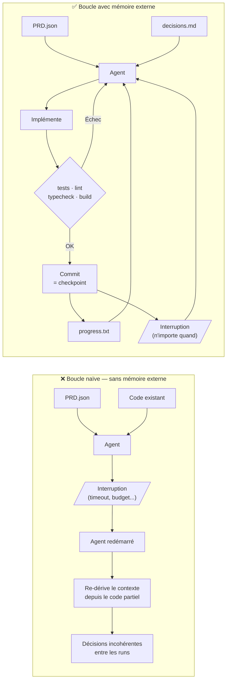

## Ralph Loop : l'agent de développement autonome qui ne se souvient de rien

> *Projet personnel public — openemail / Ralph Loop.*

C'est le cas le plus technique des cinq. Pas de client à anonymiser, pas de contraintes réglementaires. Juste un problème d'architecture que j'ai rencontré en construisant un agent de développement autonome, et la solution qui en a découlé.

La leçon est directement liée à la Partie 4 (l'amnésie de l'agent) et à la Partie 9 (le saga pattern). C'est aussi le cas qui illustre le mieux la thèse centrale du livre : **un agent n'est pas un prompt intelligent. C'est un système.**

### Le contexte

openemail est un projet que je construis : une API email simple pour développeurs, avec une logique de délivrance propre, des webhooks, une facturation au volume. Stack publique : Next.js, TypeScript, PostgreSQL/Neon, Drizzle ORM, AWS SES, Upstash QStash/Redis.

Pour accélérer le développement, j'ai expérimenté une approche agentique : un agent autonome qui prend une spécification et implémente itérativement, en bouclant jusqu'à ce que les critères de validation soient satisfaits. J'ai appelé ça **Ralph Loop**.

L'idée de base est simple : au lieu d'appeler l'agent une fois pour générer du code, on lui donne un contexte complet — les exigences, l'état actuel du code, l'historique des décisions — et on le laisse boucler jusqu'à ce que les tests passent et que le build soit propre.

### La boucle Ralph

La structure de Ralph Loop à son état mature :

```
[BOUCLE RALPH — CYCLE D'ITÉRATION]

1. Lire PRD.json
   └─ Exigences produit structurées : fonctionnalités, critères d'acceptance,
      contraintes techniques, définition de "done".

2. Lire progress.txt
   └─ Où en est-on : phase courante, dernière action validée,
      prochaine étape prévue, blocages connus.

3. Analyser le code existant
   └─ Diff git, structure de fichiers, tests existants.

4. Décider de la prochaine action
   └─ Implémentation, correction, refactoring, ou STOP
      si "done" est atteint.

5. Implémenter
   └─ Écrire ou modifier les fichiers.

6. Valider
   └─ npm run test → npm run lint → npm run typecheck → npm run build
   └─ Si une étape échoue : revenir en 4 avec le contexte d'erreur.

7. Mettre à jour progress.txt
   └─ Ce qui a été fait, ce qui reste, blocages éventuels.

8. Commiter si validé
   └─ Commit atomique avec message descriptif.

9. Reprendre en 1 jusqu'à "done" ou limite d'itérations.
```

Sur le papier, c'est élégant. En pratique, la première version avait un défaut majeur.

### Le problème : l'agent sans mémoire entre les runs

La première version de Ralph Loop n'avait pas de `progress.txt`. L'agent recevait le PRD et le code existant à chaque run, déduisait lui-même où il en était, et continuait.

Ça fonctionnait bien tant que la boucle n'était pas interrompue. Mais les interruptions arrivaient constamment : timeout API, limite de budget tokens, erreur réseau, décision d'arrêter manuellement pour vérifier.

Au redémarrage, le problème devenait visible :

```
# ❌ Run 1 (interrompu à 60%) — décision architecturale : utiliser un schéma A
# L'agent a implémenté 3 fichiers, commité 2.

# ❌ Run 2 (reprise sans progress.txt) — l'agent relit le PRD et le code
# Il voit un code partiel avec le schéma A.
# Il décide qu'une architecture B est "meilleure" pour les fichiers restants.
# Il implémente les fichiers restants avec le schéma B.
# Résultat : un repo avec deux architectures incompatibles pour la même feature.
```

Le symptôme n'était pas un crash — c'était quelque chose de pire : un état valide en apparence mais incohérent en profondeur. Les tests passaient sur les parties isolées. Le build passait. L'intégration entre les deux parties cassait de façon subtile.

Le modèle ne "se souvenait" pas d'avoir choisi l'architecture A. Il re-dérivait depuis le code partiel et faisait un choix différent — pas parce qu'il était incompétent, mais parce qu'il était stateless.

### L'architecture de mémoire externe

La solution est venue de la Partie 4 du livre (que j'étais en train d'écrire, ce qui aide) : externaliser la mémoire de l'agent dans des fichiers persistants qu'il lit explicitement à chaque run.

```
[FICHIERS D'ÉTAT RALPH LOOP]

PRD.json           — Exigences immuables (ne change pas entre runs)
progress.txt       — État mutable : phase, dernière action, prochaine étape
decisions.md       — Log des décisions architecturales (append-only)
DONE_CRITERIA.md   — Définition explicite de "terminé"
```

```python
# Structure de progress.txt
"""
# Ralph Loop — État courant

PHASE: IMPLEMENTING
ITERATION: 7
LAST_COMMIT: a3f2c1 — "feat: add webhook handler"
NEXT_ACTION: Implement retry logic for failed webhooks
DECISIONS:
  - Database schema: utilisé le schéma A (single table, pas de join)
    Raison : volume prévu faible, simplicité prime sur performance
  - Auth: Better Auth (pas JWT custom) — décision finale, ne pas rouvrir
BLOCKERS: Aucun
DONE_CRITERIA_MET: [✅] webhook handler, [ ] retry, [ ] tests e2e
"""
```

Avec cette mémoire externe, chaque run commence par lire `progress.txt` avant de faire quoi que ce soit. L'agent sait où il en est, quelles décisions ont déjà été prises (et pourquoi), et ce qui reste à faire.

```python
# ✅ Run repris — avec progress.txt
async def run_ralph_loop(project_dir: str) -> LoopResult:
    prd = load_prd(f"{project_dir}/PRD.json")
    progress = load_progress(f"{project_dir}/progress.txt")
    decisions = load_decisions(f"{project_dir}/decisions.md")

    # L'agent reçoit l'état complet — pas de re-dérivation
    context = AgentContext(
        requirements=prd,
        current_phase=progress.phase,
        last_action=progress.last_commit,
        next_action=progress.next_action,
        past_decisions=decisions,    # ← schéma A, Better Auth, etc.
        done_criteria=progress.criteria
    )

    action = await agent.decide_next_action(context)

    if action.type == "DONE":
        return LoopResult(success=True, final_commit=progress.last_commit)

    await agent.implement(action)
    await run_validation_suite()    # test → lint → typecheck → build
    await update_progress(progress, action)
    await git_commit_if_valid(action)

    return await run_ralph_loop(project_dir)  # itération suivante
```

### Le saga pattern appliqué au dev agent

Ce que Ralph Loop implémente, c'est le saga pattern de la Partie 9 (9.3), appliqué à un contexte de développement.

Chaque itération de la boucle est une **transaction** :
- Elle commence par un état connu (progress.txt au début de l'itération).
- Elle se termine par un commit (checkpoint) ou par un rollback (revert + mise à jour du progress).
- En cas d'interruption entre deux checkpoints, la reprise repart du dernier commit, pas du début.

```
# Propriétés de chaque itération Ralph Loop

ATOMICITÉ : un commit = une unité de travail logique.
COHÉRENCE : les tests/lint/typecheck/build doivent passer avant commit.
ISOLATION : chaque itération lit l'état et écrit l'état de façon explicite.
DURABILITÉ : progress.txt + git history = état persistant entre runs.
```

Ce n'est pas du ACID au sens base de données. Mais c'est la même idée : chaque étape laisse le système dans un état valide et explicite, ce qui permet la reprise sans ambiguïté.

### Ce que ça change concrètement

Avec la version naïve (sans progress.txt) :

- Une interruption à 60% → redémarrage depuis une compréhension partielle du code → risque de décisions incohérentes.
- Le débogage d'un bug introduit en run 3 nécessite de reconstituer ce que l'agent a "compris" en run 3 — sans trace, c'est impossible.
- Le budget tokens par run est plus élevé : l'agent re-dérive le contexte complet à chaque fois.

Avec la version mature (progress.txt + decisions.md) :

- Reprise depuis l'état exact du dernier commit, quelle que soit la cause de l'interruption.
- Traçabilité complète des décisions architecturales — et de leurs raisons.
- Budget tokens réduit : l'agent lit un résumé structuré plutôt que de re-analyser tout le code.



### La leçon

**Un agent de développement autonome sans mémoire externe est fondamentalement fragile.** Pas parce que le modèle est mauvais — mais parce qu'il est stateless par design. L'état doit vivre ailleurs.

Ralph Loop illustre trois principes du livre :

1. **Partie 4 — L'agent est amnésique.** Sans externalisation explicite de la mémoire, l'agent repart de zéro à chaque run. Pas partiellement — complètement.

2. **Partie 9 — Le saga pattern.** Chaque étape doit laisser le système dans un état valide et persistant. Ce n'est pas une garantie du modèle — c'est une propriété à construire dans l'architecture.

3. **Partie 5 — Les boucles naïves cassent.** Une boucle ReAct sans bornes ni checkpoints accumule les erreurs et ne sait pas s'arrêter proprement. La définition de "done" doit être explicite, lisible par l'agent, et vérifiable par une validation automatisée.

Un agent de code autonome est un agent comme les autres : ses garanties de fiabilité ne viennent pas du modèle. Elles viennent de l'architecture dans laquelle il s'exécute.
